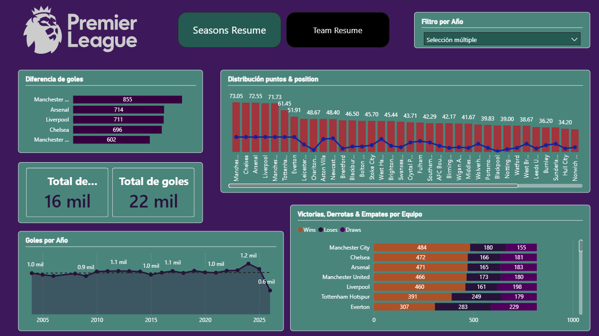
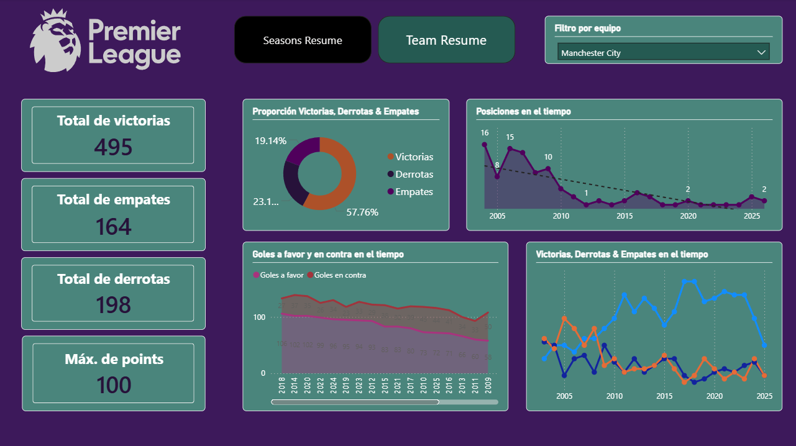

# Analítica de la Premier League

Este proyecto implementa un pipeline de datos completo para analizar estadísticas de los resultados Premier League hasta el ultimo performance en el 2025.

## Setup de la extracción y base de datos

- selenium para la extracción de datos
- ChromeDriver (ver la [version](https://googlechromelabs.github.io/chrome-for-testing/) adecuada a Chrome) cuyo directorio debe estar en las variables de entorno PATH del sistema
- python-dotenv para la gestión de variables de entorno
- PostgreSQL y psycopg2 para la conexión a la base de datos

## Scripts del Proyecto

- **driver.py**: Extrae datos de temporadas, equipos y estadísticas desde ESPN usando Selenium. Genera `seasons.csv` y archivos crudos en `teams/` y `registers/`.
- **data.py**: Limpia y estructura los datos extraídos. Genera `season_teams.csv` y `stat_registers.csv`.
- **setup.py**: Inicializa la base de datos PostgreSQL (usando `model.psql`) y carga los datos desde los archivos CSV generados.

## Resultado en Power BI

El archivo `dashboard.pbix` contiene un informe interactivo con dos vistas principales:

### Parte Seasons (Reporte de Temporadas)

Esta vista proporciona una radiografía completa de una temporada específica de la Premier League.

**Métricas Clave:**
- **Tabla de Posiciones**: Clasificación final con Puntos, Partidos Jugados (GP), Victorias (W), Empates (D) y Derrotas (L).
- **Rendimiento Ofensivo/Defensivo**: Goles a Favor (F), Goles en Contra (A) y Diferencia de Goles (GD).
- **Comparativas**: Gráficos de barras y visuales para comparar el rendimiento de los equipos en esa temporada.

### Parte Teams (Reporte de Equipos)

Esta vista se centra en el análisis histórico de un equipo seleccionado a lo largo de los años.

**Análisis Histórico:**
- **Evolución de Posiciones**: Tendencia de la clasificación del equipo temporada tras temporada.
- **Historial de Puntos**: Comparativa de desempeño (puntos obtenidos) a lo largo de la historia.
- **Estadísticas Acumuladas**: Resumen de victorias, empates, derrotas y goles a lo largo de todas las temporadas registradas.
